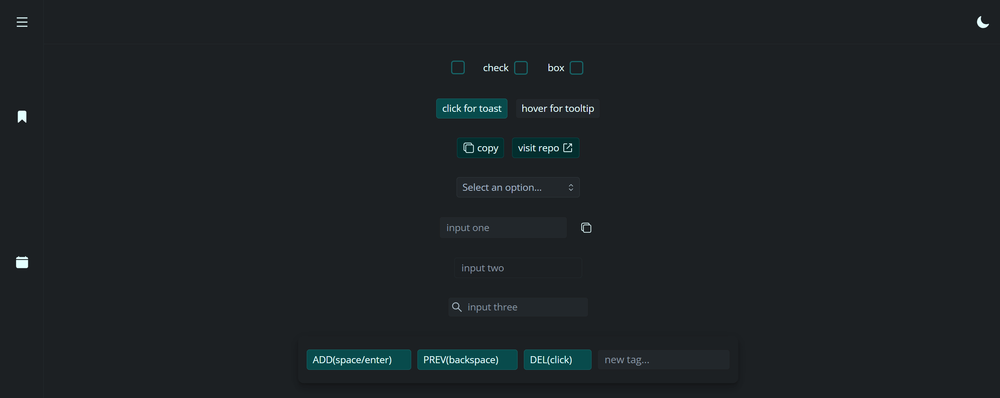

# PREACT : starter kit

## [REACT VERSION](https://github.com/chaseottofy/react-boilerplate)

[PREACTJS DOCUMENTS](https://preactjs.com/)

## Light Theme 

## Dark Theme

## Med Theme

Designed specifically to acheive perfect lighthouse scores. Adheres to all Accessibility standards (aria, tabbing, contrast, etc.) and is a perfect starting point in terms of SEO (no plugins). Comes with several custom components, a few custom hooks, several utility functions, over 100 useful CSS classes, typed props, and responsive design. Written to be as lightweight as possible without sacrificing utility.

### Lighthouse

* adheres to aria guidelines
  * logical tab order (all interactive elements are focusable)
  * offscreen component content will not appear to aria
  * proper roles/labels/attributes
  * accessible names
* adheres to all trust & safety best practices
  * zero plugins
* lighthouse (100 100 100 100)
* Custom Components :

### Styling

* vanilla css
* three themes
  * each theme features 26 carefully chosen colors
  * Each theme passes AAA WCAG Contrast Minimums
  * all components have both dark/primary variations for each theme
* Built with mobile first in mind - responsive for any orientation
* proper balance of REM units for easy queries
* over 100 reusable CSS classes for core elements like buttons/input
* extensive, carefully crafted CSS reset to handle modern browsers
* four locally downloaded & pre-configured fonts to choose from (!use only 2)

### Custom Components

* All components configured with prop-types and attributes to handle aria.
* Tooltip Component
  * close on click outside
  * 4 base configurations (left/right/bottom/top)
  * dynamic positioning (left & right bounds)
  * easy configuration (wrap element & provide title)
* Toast Component (popups/alerts)
  * close on click outside
  * pass callback
  * timeout
  * tiny - less than 800 bytes gzipped
* Select Component (custom)
  * close on click outside
  * dynamic positioning (opens on top or bottom depending on space)
* Tag Component
  * [tag component demo on codepen](https://codepen.io/chaseottofy/pen/PodQNKO)
* Checkbox Component

### Other Components

* Sidebar
* Header
* Link
* Button
  * Four variations
* Input
  * Four variations

### Utility Functions

* 9 date/time methods
* copy to clipboard method
* form validation
* generate uuid
* handle user preferences (light/dark mode) / locale
* handle popup bounds (adjust popup location based on window)
* enable location

### Custom Hooks

* useDebounce
* useIsFirstRender
* useLocal
* useClickOutside
